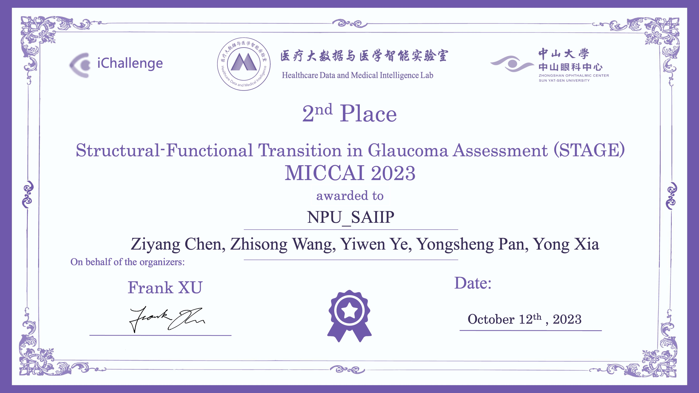

# STAGE 2023 (2nd Award)
Code for Structural-Functional Transition in Glaucoma Assessment Challenge 2023 (STAGE 2023)
<p align="center">
     <br />
</p>

## Preparing
1. Clone this repo:
```bash
git clone https://github.com/Chen-Ziyang/STAGE2023.git
cd STAGE2023
```
2. Download the pre-trained weights and move them into `model_checkpoints` folder of each task,
   which can be found in this [Google Drive Link](https://drive.google.com/file/d/1vmMkYn_XBk_FQFJmYx6ZsoGtEfOClVpS/view?usp=drive_link).

3. Download the dataset from the [official website](https://aistudio.baidu.com/competition/detail/968/0/datasets).

4. Create the experimental environment in your own way or download ours from this [Google Drive Link](https://drive.google.com/file/d/1kVg5-zIXz09dSliTTKs3QtvMA80-Afmb/view?usp=drive_link).
 
## Training
1. Task 1: Prediction of Mean Deviation
```bash
python STAGE2023_Task1/train_MixLoss.py
```
2. Task 2: Sensitivity map prediction
```bash
python STAGE2023_Task2/train_MixLoss.py
```
3. Task 3: Pattern deviation probability map prediction
```bash
python STAGE2023_Task3/train.py
```

## Inference
1. Task 1: Prediction of Mean Deviation
```bash
python STAGE2023_Task1/test.py
```
2. Task 2: Sensitivity map prediction
```bash
python STAGE2023_Task2/test.py
```
3. Task 3: Pattern deviation probability map prediction
```bash
python STAGE2023_Task3/test.py
```
